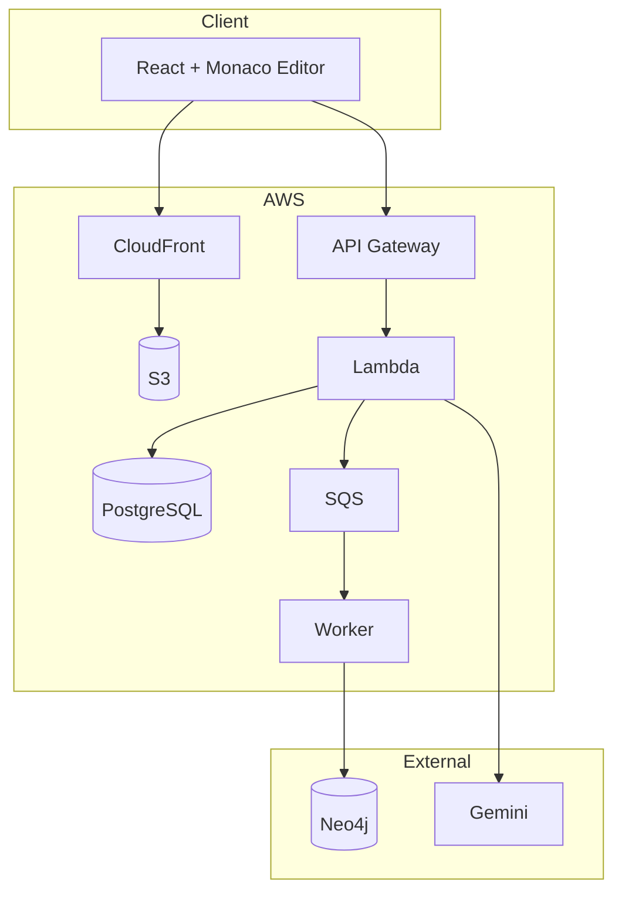

# Code Remote Documentation

> **Remote Code Execution Engine** - Secure Python execution with AI-powered complexity analysis

---

## Quick Navigation

| Section | Description |
|---------|-------------|
| [Architecture](architecture/) | System design, components, technology stack |
| [Deployment](deployment/) | CI/CD, releases, local development |
| [Diagrams](diagrams/) | Visual architecture diagrams |

---

## Architecture Documentation

| Document | Description |
|----------|-------------|
| [Overview](architecture/overview.md) | High-level architecture, tech stack, design decisions |
| [Backend](architecture/backend.md) | FastAPI application, services, API design |
| [Frontend](architecture/frontend.md) | React app, components, state management |
| [Infrastructure](architecture/infrastructure.md) | AWS resources, Pulumi IaC |
| [Security](architecture/security.md) | Sandbox design, security layers |
| [Data Model](architecture/data-model.md) | PostgreSQL + Neo4j schemas |

---

## Deployment Documentation

| Document | Description |
|----------|-------------|
| [CI/CD Pipeline](deployment/ci-cd.md) | GitHub Actions workflow |
| [Release Strategy](deployment/release-strategy.md) | Versioning, environments |
| [Local Development](deployment/local-development.md) | Docker Compose setup |

---

## System Overview



---

## Technology Stack

| Layer | Technology |
|-------|------------|
| Frontend | React 18, TypeScript, Monaco Editor, Zustand |
| Backend | FastAPI, Python 3.11, SQLAlchemy, Pydantic |
| Database | Aurora PostgreSQL, Neo4j AuraDB |
| Infrastructure | AWS Lambda, API Gateway, SQS, CloudFront |
| LLM | Google Gemini API |
| IaC | Pulumi (Python) |
| CI/CD | GitHub Actions |

---

## Quick Start

### Local Development
```bash
# Option 1: Docker Compose
docker compose up -d
# Frontend: http://localhost:3000
# Backend: http://localhost:8000

# Option 2: Manual
cd backend && uvicorn api.main:app --reload --port 8000
cd frontend && npm run dev
```

### Deploy
```bash
# Deploy to dev
git push origin main

# Deploy to prod
git tag v1.0.0 && git push origin v1.0.0
```

---

## Project Structure

```text
code-remote/
├── frontend/           # React + Monaco Editor
├── backend/
│   ├── api/            # FastAPI application
│   ├── executor/       # Sandboxed Python runner
│   ├── analyzer/       # Gemini LLM integration
│   └── common/         # Shared utilities
├── infra/pulumi/       # Infrastructure as Code
├── docs/               # Documentation (you are here)
└── .github/workflows/  # CI/CD pipelines
```

---

## Key Features

- **Monaco Editor** - VS Code's editor with Python syntax
- **Secure Execution** - Sandboxed with import restrictions
- **AI Analysis** - Gemini-powered complexity analysis
- **Real-Time** - WebSocket execution updates
- **Snippets** - Save, star, and search code
- **Semantic Search** - Vector-based code search via Neo4j
