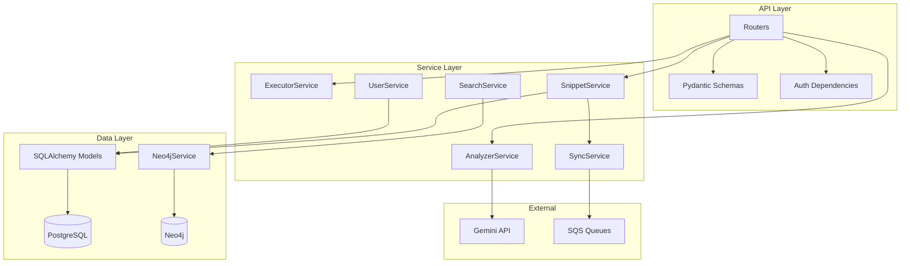
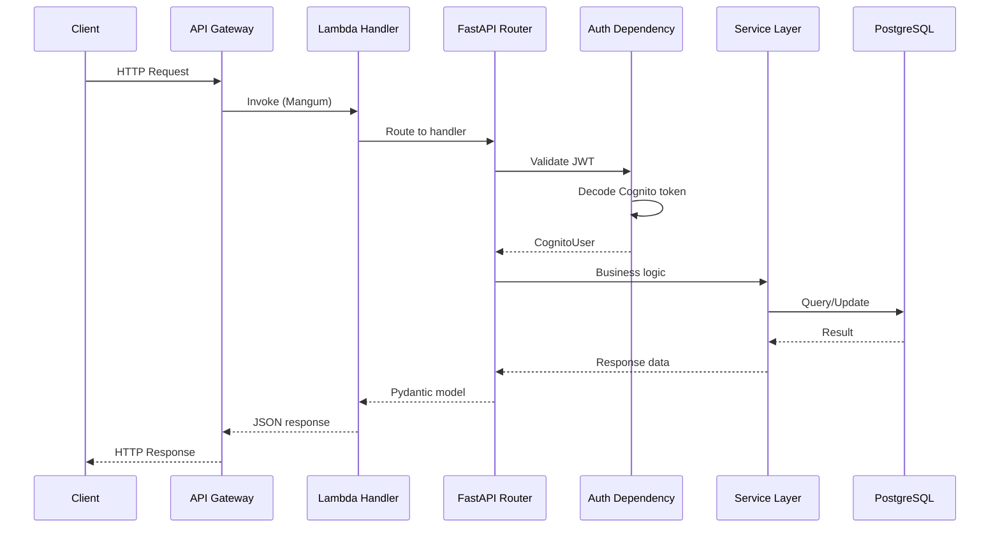
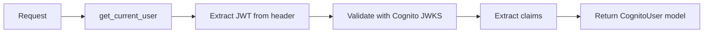

# Backend Architecture

The Code Remote backend is a FastAPI application deployed as an AWS Lambda function using the Mangum adapter.

---

## Technology Stack

| Component | Technology | Purpose |
|-----------|------------|---------|
| **Framework** | FastAPI | Async Python web framework |
| **Lambda Adapter** | Mangum | ASGI → Lambda handler |
| **Validation** | Pydantic | Request/response schemas |
| **ORM** | SQLAlchemy 2.0 | Async PostgreSQL access |
| **Migrations** | Alembic | Database schema migrations |
| **Auth** | AWS Cognito | JWT validation |
| **LLM** | google-genai | Gemini API client |

---

## Directory Structure

```
backend/
├── api/
│   ├── main.py              # FastAPI app entry point
│   ├── lambda_handler.py    # Mangum Lambda handler
│   ├── migrate_handler.py   # Migration Lambda handler
│   ├── routers/             # API route handlers
│   │   ├── health.py        # GET /health
│   │   ├── execution.py     # POST /execute, /execute/async
│   │   ├── analysis.py      # POST /analyze
│   │   ├── snippets.py      # CRUD /snippets
│   │   ├── search.py        # GET /search
│   │   └── websocket.py     # WebSocket handlers
│   ├── schemas/             # Pydantic models
│   ├── services/            # Business logic layer
│   │   ├── executor_service.py
│   │   ├── analyzer_service.py
│   │   ├── snippet_service.py
│   │   ├── user_service.py
│   │   ├── sync_service.py
│   │   ├── search_service.py
│   │   ├── neo4j_service.py
│   │   └── database.py
│   ├── models/              # SQLAlchemy models
│   │   ├── base.py
│   │   ├── user.py
│   │   └── snippet.py
│   ├── auth/                # Authentication
│   │   ├── cognito.py       # Cognito JWT validation
│   │   ├── dependencies.py  # FastAPI dependencies
│   │   └── models.py        # Auth models
│   └── handlers/            # Lambda handlers (non-HTTP)
│       ├── worker.py        # SQS execution worker
│       └── sync_worker.py   # SQS Neo4j sync worker
├── executor/                # Code execution sandbox
│   ├── runner.py            # Main execution logic
│   └── security.py          # Import restrictions, AST validation
├── analyzer/                # LLM complexity analysis
│   ├── complexity.py        # Analysis orchestration
│   ├── llm_provider.py      # Provider interface
│   └── providers/
│       └── gemini.py        # Gemini implementation
├── neo4j_migrations/        # Neo4j schema migrations
│   ├── runner.py
│   └── versions/
├── alembic/                 # PostgreSQL migrations
│   └── versions/
├── common/                  # Shared utilities
│   └── config.py            # Pydantic settings
└── tests/
    ├── unit/
    ├── integration/
    └── smoke/
```

---

## Application Layers



---

## API Endpoints

### Health

| Method | Path | Auth | Description |
|--------|------|------|-------------|
| GET | `/health` | No | Health check |

### Execution

| Method | Path | Auth | Description |
|--------|------|------|-------------|
| POST | `/execute` | Yes | Synchronous execution (blocking) |
| POST | `/execute/async` | Yes | Async execution via SQS + WebSocket |

### Analysis

| Method | Path | Auth | Description |
|--------|------|------|-------------|
| POST | `/analyze` | Yes | LLM complexity analysis |

### Snippets

| Method | Path | Auth | Description |
|--------|------|------|-------------|
| GET | `/snippets` | Yes | List user's snippets |
| POST | `/snippets` | Yes | Create snippet |
| GET | `/snippets/{id}` | Yes | Get snippet by ID |
| PUT | `/snippets/{id}` | Yes | Update snippet |
| DELETE | `/snippets/{id}` | Yes | Delete snippet |
| POST | `/snippets/{id}/star` | Yes | Toggle star status |

### Search

| Method | Path | Auth | Description |
|--------|------|------|-------------|
| GET | `/search` | Yes | Semantic search via Neo4j |

---

## Request Flow



---

## Key Services

### ExecutorService

Executes user code in a secure sandbox:

```python
class ExecutorService:
    async def execute(self, code: str, timeout: int = 30) -> ExecutionResult:
        # 1. Validate code (AST analysis, import check)
        validator = SecurityValidator()
        validator.validate(code)
        
        # 2. Execute in restricted environment
        result = run_sandboxed(code, timeout=timeout)
        
        # 3. Return structured result
        return ExecutionResult(
            success=result.success,
            stdout=result.stdout,
            stderr=result.stderr,
            execution_time_ms=result.time_ms,
        )
```

### AnalyzerService

Analyzes code complexity using Gemini:

```python
class AnalyzerService:
    async def analyze(self, code: str) -> ComplexityResult:
        prompt = load_prompt("complexity.txt").format(code=code)
        response = await self.llm.generate(prompt)
        return parse_complexity_response(response)
```

### SnippetService

CRUD operations with sync queue integration:

```python
class SnippetService:
    async def create(self, user_id: UUID, data: SnippetCreate) -> Snippet:
        snippet = Snippet(user_id=user_id, **data.model_dump())
        self.db.add(snippet)
        await self.db.flush()
        
        # Trigger async sync to Neo4j
        await self.sync_service.enqueue_created(snippet.id)
        
        return snippet
```

### UserService

Lazy user sync from Cognito:

```python
class UserService:
    async def get_or_create_from_cognito(
        self, cognito_sub: str, email: str, username: str
    ) -> User:
        user = await self.get_by_cognito_sub(cognito_sub)
        if user is None:
            user = User(cognito_sub=cognito_sub, email=email, username=username)
            self.db.add(user)
        user.last_login = datetime.now(UTC)
        await self.db.flush()
        return user
```

---

## Configuration

Settings are loaded from environment variables via Pydantic:

```python
# common/config.py
class Settings(BaseSettings):
    # Application
    debug: bool = False
    environment: str = "development"
    
    # Execution limits
    execution_timeout_seconds: int = 30
    max_code_size_bytes: int = 10240  # 10KB
    
    # Database
    database_url: str = ""
    database_secret_arn: str = ""  # AWS Secrets Manager
    
    # Gemini
    gemini_api_key: str = ""
    gemini_model: str = "gemini-2.5-flash"
    
    # AWS
    aws_region: str = "us-east-1"
    cognito_user_pool_id: str = ""
    cognito_client_id: str = ""
    
    # Queues
    execution_queue_url: str = ""
    snippet_sync_queue_url: str = ""
```

---

## Authentication

JWT tokens from Cognito are validated on each request:



---

## Testing Strategy

```bash
# Unit tests (mocked dependencies)
pytest tests/unit/ -v

# Integration tests (real database via Docker)
docker-compose -f docker-compose.test.yml up -d
pytest tests/integration/ -v

# Smoke tests (deployed environment)
pytest tests/smoke/ --env=dev
```

### Test Coverage Requirements

| Area | Minimum Coverage |
|------|------------------|
| Services | 80% |
| Routers | 70% |
| Security | 90% |

---

## Error Handling

All exceptions are caught and returned as structured responses:

```python
@app.exception_handler(SecurityError)
async def security_error_handler(request, exc):
    return JSONResponse(
        status_code=400,
        content={"error": "security_violation", "message": str(exc)},
    )

@app.exception_handler(TimeoutError)
async def timeout_handler(request, exc):
    return JSONResponse(
        status_code=408,
        content={"error": "execution_timeout", "message": "Code exceeded 30s limit"},
    )
```

---

## Related Documents

- [Security Model](security.md) - Sandbox implementation details
- [Data Model](data-model.md) - Database schemas
- [API Reference](../api-reference.md) - OpenAPI documentation
