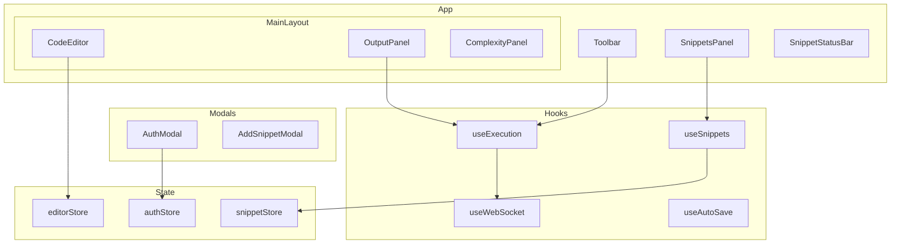
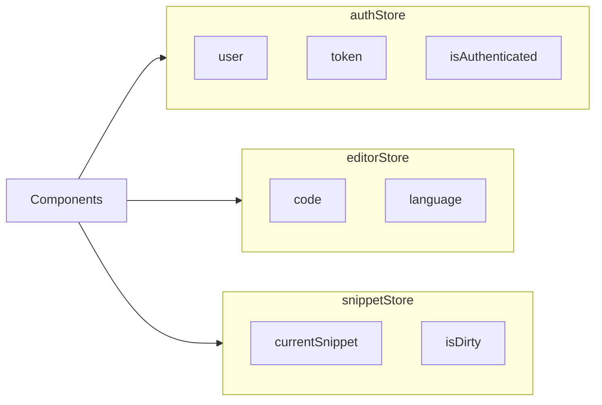
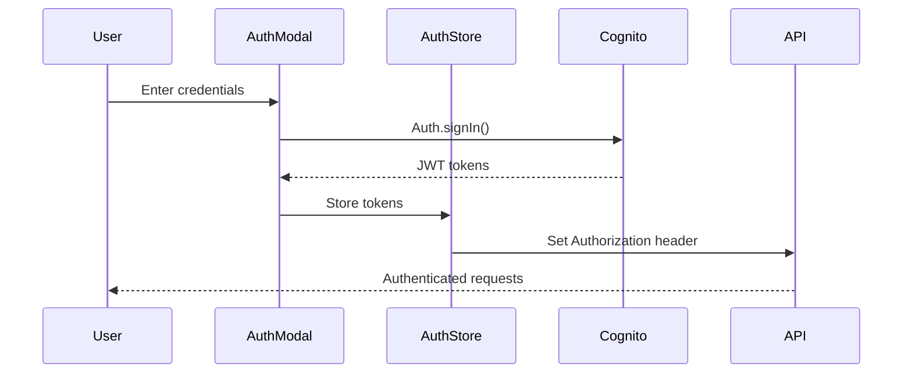
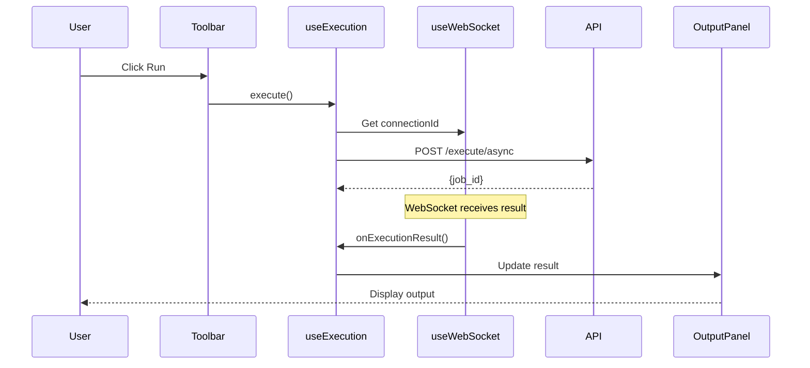

# Frontend Architecture

The Code Remote frontend is a React 18 single-page application with TypeScript, featuring a Monaco Editor for code editing and real-time execution via WebSocket.

---

## Technology Stack

| Component | Technology | Purpose |
|-----------|------------|---------|
| **Framework** | React 18 | UI library |
| **Language** | TypeScript | Type safety |
| **Build** | Vite | Fast development/build |
| **Editor** | Monaco Editor | VS Code's editor component |
| **State** | Zustand | Global state management |
| **Server State** | React Query | API data caching |
| **HTTP** | Axios | API client |
| **Auth** | AWS Amplify | Cognito integration |
| **Styling** | CSS Modules | Scoped styles |

---

## Directory Structure

```
frontend/
├── src/
│   ├── main.tsx             # App entry point
│   ├── App.tsx              # Root component
│   ├── App.css              # Global styles
│   ├── index.css            # CSS reset/base
│   │
│   ├── components/          # React components
│   │   ├── CodeEditor.tsx   # Monaco Editor wrapper
│   │   ├── OutputPanel.tsx  # Execution output display
│   │   ├── ComplexityPanel.tsx  # LLM analysis display
│   │   ├── Toolbar.tsx      # Action buttons + status
│   │   ├── SnippetsPanel.tsx    # Snippet list
│   │   ├── AddSnippetModal.tsx  # Save snippet dialog
│   │   ├── AuthModal.tsx    # Login/Register modal
│   │   ├── LoginForm.tsx    # Login form
│   │   ├── RegisterForm.tsx # Registration form
│   │   ├── ConfirmationForm.tsx # Email confirmation
│   │   ├── UserMenu.tsx     # User dropdown
│   │   ├── SnippetStatusBar.tsx # Current snippet info
│   │   └── index.ts         # Component exports
│   │
│   ├── hooks/               # Custom React hooks
│   │   ├── useExecution.ts  # Code execution with fallback
│   │   ├── useWebSocket.ts  # WebSocket connection
│   │   ├── useSnippets.ts   # Snippet CRUD operations
│   │   ├── useAutoSave.ts   # Auto-save functionality
│   │   └── index.ts
│   │
│   ├── store/               # Zustand stores
│   │   ├── authStore.ts     # Authentication state
│   │   ├── editorStore.ts   # Editor content state
│   │   └── snippetStore.ts  # Current snippet state
│   │
│   ├── api/                 # API client functions
│   │   ├── client.ts        # Axios instance
│   │   ├── execution.ts     # Execute/analyze calls
│   │   ├── snippets.ts      # Snippet CRUD
│   │   └── auth.ts          # Auth helpers
│   │
│   ├── types/               # TypeScript types
│   │   ├── execution.ts
│   │   ├── snippet.ts
│   │   └── auth.ts
│   │
│   ├── config/              # Configuration
│   │   └── index.ts         # Environment variables
│   │
│   └── utils/               # Utility functions
│
├── public/                  # Static assets
├── index.html               # HTML template
├── vite.config.ts           # Vite configuration
├── tsconfig.json            # TypeScript config
└── package.json
```

---

## Component Architecture



---

## Key Components

### CodeEditor

Monaco Editor wrapper with Python language support:

```tsx
// components/CodeEditor.tsx
import Editor from "@monaco-editor/react";

export function CodeEditor() {
  const { code, setCode } = useEditorStore();

  return (
    <Editor
      height="100%"
      language="python"
      theme="vs-dark"
      value={code}
      onChange={(value) => setCode(value || "")}
      options={{
        minimap: { enabled: false },
        fontSize: 14,
        automaticLayout: true,
      }}
    />
  );
}
```

### Toolbar

Action buttons with connection status:

```tsx
// components/Toolbar.tsx
export function Toolbar() {
  const { execute, isExecuting } = useExecution();
  const { isConnected } = useWebSocket();
  const { isAuthenticated } = useAuthStore();

  return (
    <div className="toolbar">
      <button onClick={execute} disabled={isExecuting || !isAuthenticated}>
        {isExecuting ? "Running..." : "Run"}
      </button>
      <ConnectionIndicator connected={isConnected} />
    </div>
  );
}
```

---

## State Management

### Zustand Stores



#### Auth Store

```typescript
// store/authStore.ts
interface AuthState {
  user: User | null;
  token: string | null;
  isAuthenticated: boolean;
  login: (email: string, password: string) => Promise<void>;
  logout: () => void;
  refreshToken: () => Promise<void>;
}

export const useAuthStore = create<AuthState>((set) => ({
  user: null,
  token: null,
  isAuthenticated: false,
  login: async (email, password) => {
    const result = await Auth.signIn(email, password);
    set({ user: result.user, token: result.token, isAuthenticated: true });
  },
  logout: () => {
    Auth.signOut();
    set({ user: null, token: null, isAuthenticated: false });
  },
}));
```

---

## Custom Hooks

### useExecution

Handles code execution with WebSocket/HTTP fallback:

```typescript
// hooks/useExecution.ts
export function useExecution() {
  const { code } = useEditorStore();
  const { connectionId, isConnected } = useWebSocket();
  const [result, setResult] = useState<ExecutionResult | null>(null);
  const [isExecuting, setIsExecuting] = useState(false);

  const execute = async () => {
    setIsExecuting(true);
    try {
      if (isConnected && connectionId) {
        // Async execution via WebSocket
        await api.executeAsync(code, connectionId);
        // Result will arrive via WebSocket
      } else {
        // Fallback to sync execution
        const result = await api.execute(code);
        setResult(result);
      }
    } finally {
      setIsExecuting(false);
    }
  };

  return { execute, result, isExecuting };
}
```

### useWebSocket

Manages WebSocket connection with auto-reconnect:

```typescript
// hooks/useWebSocket.ts
export function useWebSocket() {
  const [isConnected, setIsConnected] = useState(false);
  const [connectionId, setConnectionId] = useState<string | null>(null);
  const wsRef = useRef<WebSocket | null>(null);

  useEffect(() => {
    const connect = () => {
      const ws = new WebSocket(config.WEBSOCKET_URL);
      
      ws.onopen = () => {
        setIsConnected(true);
        // Send ping to get connection ID
        ws.send(JSON.stringify({ action: "ping" }));
      };

      ws.onmessage = (event) => {
        const data = JSON.parse(event.data);
        if (data.type === "pong") {
          setConnectionId(data.connection_id);
        } else if (data.type === "execution_result") {
          // Handle execution result
          onExecutionResult(data);
        }
      };

      ws.onclose = () => {
        setIsConnected(false);
        // Auto-reconnect after 3s
        setTimeout(connect, 3000);
      };

      wsRef.current = ws;
    };

    connect();
    return () => wsRef.current?.close();
  }, []);

  return { isConnected, connectionId };
}
```

---

## Data Flow

### Authentication Flow



### Execution Flow



---

## Environment Configuration

```typescript
// config/index.ts
export const config = {
  API_URL: import.meta.env.VITE_API_URL || "http://localhost:8000",
  WEBSOCKET_URL: import.meta.env.VITE_WEBSOCKET_URL,
  COGNITO_USER_POOL_ID: import.meta.env.VITE_COGNITO_USER_POOL_ID,
  COGNITO_CLIENT_ID: import.meta.env.VITE_COGNITO_CLIENT_ID,
  COGNITO_REGION: import.meta.env.VITE_COGNITO_REGION || "us-east-1",
};
```

### Environment Files

```bash
# .env.development
VITE_API_URL=http://localhost:8000
VITE_WEBSOCKET_URL=ws://localhost:8000/ws

# .env.production (injected at build time)
VITE_API_URL=https://api.coderemote.example.com
VITE_WEBSOCKET_URL=wss://ws.coderemote.example.com
VITE_COGNITO_USER_POOL_ID=us-east-1_XXXXXX
VITE_COGNITO_CLIENT_ID=xxxxxxxxxx
```

---

## Build & Development

### Development

```bash
# Install dependencies
npm install

# Start dev server (port 5173)
npm run dev

# Type checking
npm run type-check

# Linting
npm run lint
```

### Production Build

```bash
# Build for production
npm run build

# Preview production build
npm run preview
```

---

## Testing

```bash
# Run tests
npm run test

# Watch mode
npm run test:watch

# Coverage
npm run test:coverage
```

### Testing Stack

| Tool | Purpose |
|------|---------|
| Vitest | Test runner |
| React Testing Library | Component testing |
| MSW | API mocking |

---

## Performance Considerations

1. **Monaco Editor** - Lazy loaded to reduce initial bundle
2. **Code Splitting** - Routes are dynamically imported
3. **React Query** - Caches API responses
4. **WebSocket** - Reduces HTTP overhead for real-time updates

---

## Related Documents

- [Architecture Overview](overview.md) - System architecture
- [Backend Architecture](backend.md) - API documentation
- [Local Development](../deployment/local-development.md) - Setup guide
