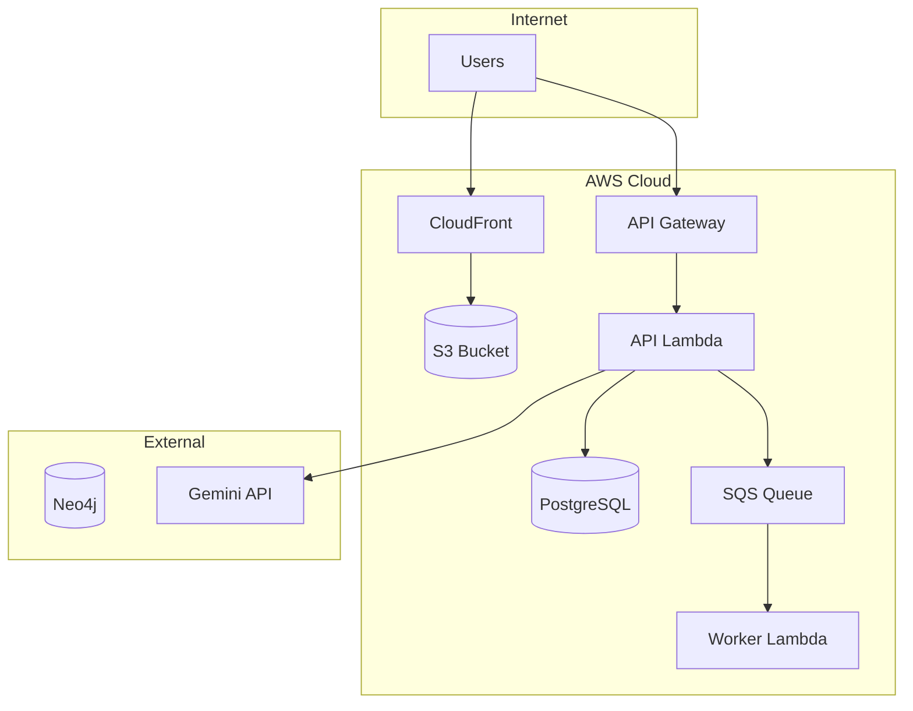

# Infrastructure Architecture

Code Remote infrastructure is managed with Pulumi (Python) and deployed to AWS.

---

## AWS Architecture



---

## Resource Inventory

| Resource | Type | Description |
|----------|------|-------------|
| API Lambda | Lambda Container | FastAPI app, 512MB, 30s |
| Worker Lambda | Lambda Container | Code executor, 256MB, 30s |
| Sync Worker | Lambda Container | Neo4j sync, 512MB, 60s |
| HTTP API | API Gateway v2 | REST endpoints |
| WebSocket API | API Gateway v2 | Real-time updates |
| Frontend Bucket | S3 | React build |
| Aurora Cluster | RDS | PostgreSQL Serverless v2 |
| Execution Queue | SQS FIFO | Job queue |

---

## Pulumi Structure

```
infra/pulumi/
├── __main__.py
├── Pulumi.yaml
├── Pulumi.dev.yaml
├── Pulumi.prod.yaml
└── components/
    ├── vpc.py
    ├── ecr.py
    ├── cognito.py
    ├── secrets.py
    ├── database.py
    ├── messaging.py
    ├── serverless_api.py
    ├── websocket.py
    ├── worker.py
    ├── sync_worker.py
    ├── migration.py
    ├── frontend.py
    └── neo4j.py
```

---

## Stack Outputs

| Output | Description |
|--------|-------------|
| api_endpoint | API Gateway URL |
| api_function_name | Lambda name |
| frontend_url | CloudFront URL |
| cognito_user_pool_id | Cognito ID |
| websocket_endpoint | WebSocket URL |

---

## Commands

```bash
cd infra/pulumi
pulumi stack select dev
pulumi preview
pulumi up --yes
pulumi stack output
```
