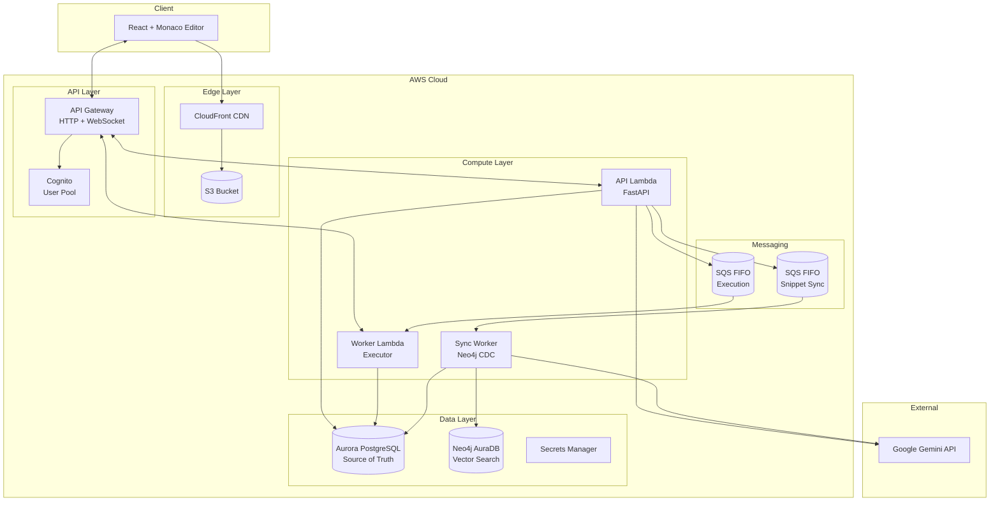
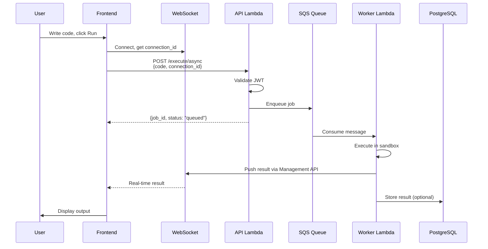
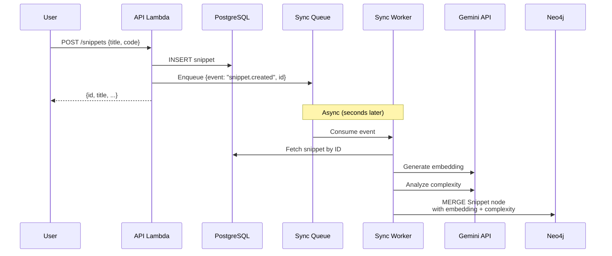

# System Architecture Overview

## Mission

Build a secure, scalable, cloud-native remote code execution platform that allows users to write Python code in a web interface, execute it safely, and receive AI-powered complexity analysis.

---

## Architecture Style

**Serverless Hybrid Architecture**

| Layer | Approach | Services |
|-------|----------|----------|
| **API** | Fully Managed | API Gateway (HTTP + WebSocket) + Lambda |
| **Compute** | Serverless | AWS Lambda with container images |
| **Data** | Hybrid Managed | Aurora PostgreSQL + Neo4j AuraDB |
| **Frontend** | Static CDN | S3 + CloudFront |
| **Auth** | Managed | AWS Cognito |

---

## High-Level Architecture

---

## Technology Stack

| Component | Technology | Purpose |
|-----------|------------|---------|
| **Frontend** | React 18 + TypeScript | Web application |
| **Editor** | Monaco Editor | Code editing (VS Code's editor) |
| **State** | Zustand + React Query | Client state management |
| **API** | FastAPI + Mangum | Python async API on Lambda |
| **Execution** | Lambda sandbox | Isolated code execution |
| **Queue** | SQS FIFO | Ordered job processing |
| **Real-time** | API Gateway WebSocket | Live execution updates |
| **Auth** | AWS Cognito | User authentication |
| **Database** | Aurora PostgreSQL Serverless v2 | Primary data store |
| **Search** | Neo4j AuraDB | Vector/semantic search |
| **LLM** | Google Gemini API | Complexity analysis + embeddings |
| **IaC** | Pulumi (Python) | Infrastructure as Code |
| **CI/CD** | GitHub Actions | Automated deployment |

---

## Component Responsibilities

### Frontend (React + Monaco)
- Browser-based code editor with Python syntax highlighting
- WebSocket connection for real-time execution updates
- Authentication flow via Cognito
- Snippet management UI (save, load, star, search)

### API Lambda (FastAPI)
- Request validation and JWT authentication
- Synchronous endpoints: `/health`, `/analyze`
- Async execution: queue jobs to SQS, return job ID
- CRUD operations for snippets → PostgreSQL
- Trigger Neo4j sync on snippet changes

### Worker Lambda (Executor)
- Consumes jobs from SQS FIFO queue
- Executes code in security sandbox
- Pushes results via WebSocket Management API
- Stores execution results in PostgreSQL

### Sync Worker Lambda (Neo4j CDC)
- Consumes snippet change events from SQS
- Fetches snippet from PostgreSQL
- Generates embeddings via Gemini
- Runs complexity analysis via Gemini
- Upserts to Neo4j with embeddings + complexity

---

## Data Flow

### Code Execution Flow

### Snippet Save + Sync Flow

---

## Key Design Decisions

| Decision | Choice | Rationale |
|----------|--------|-----------|
| **Serverless** | Lambda + API Gateway | Zero ops, auto-scaling, pay-per-use |
| **Dual Database** | PostgreSQL + Neo4j | Relational CRUD + vector search |
| **Async Execution** | SQS + WebSocket | Non-blocking, real-time feedback |
| **LLM Provider** | Google Gemini | API key only, no GCP project setup |
| **Execution Timeout** | 30 seconds | Balance between power and abuse prevention |
| **CDC Pattern** | Queue-based | Decouples API from sync, retry built-in |

---

## Project Structure

\`\`\`
code-remote/
├── frontend/                # React + Monaco Editor
│   ├── src/
│   │   ├── components/      # UI components
│   │   ├── hooks/           # Custom React hooks
│   │   ├── store/           # Zustand state
│   │   ├── api/             # API client
│   │   └── types/           # TypeScript types
│   └── package.json
│
├── backend/
│   ├── api/                 # FastAPI application
│   │   ├── routers/         # Route handlers
│   │   ├── schemas/         # Pydantic models
│   │   ├── services/        # Business logic
│   │   ├── models/          # SQLAlchemy models
│   │   ├── auth/            # Cognito integration
│   │   └── handlers/        # Lambda handlers
│   ├── executor/            # Sandboxed Python runner
│   ├── analyzer/            # Gemini LLM integration
│   ├── neo4j_migrations/    # Neo4j schema migrations
│   ├── alembic/             # PostgreSQL migrations
│   ├── common/              # Shared utilities
│   └── tests/               # Unit/integration tests
│
├── infra/pulumi/            # Infrastructure as Code
│   ├── components/          # Reusable Pulumi components
│   ├── Pulumi.*.yaml        # Stack configurations
│   └── __main__.py          # Entry point
│
├── docs/                    # Documentation
│   ├── architecture/        # Architecture docs
│   ├── deployment/          # Deployment guides
│   └── diagrams/            # Visual diagrams
│
└── .github/workflows/       # CI/CD pipelines
\`\`\`

---

## Related Documents

- [Backend Architecture](backend.md) - FastAPI services and API design
- [Frontend Architecture](frontend.md) - React application structure
- [Infrastructure](infrastructure.md) - AWS resources and Pulumi IaC
- [Security Model](security.md) - Sandbox and security layers
- [Data Model](data-model.md) - PostgreSQL and Neo4j schemas
