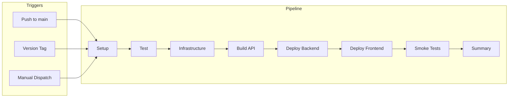
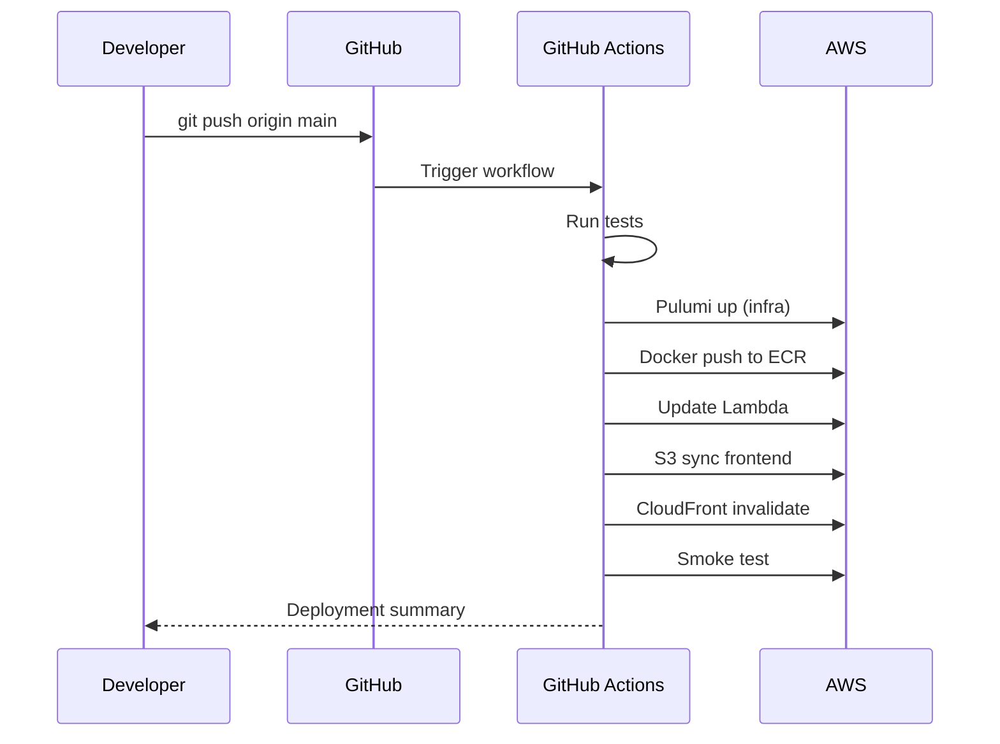

# CI/CD Pipeline

Code Remote uses GitHub Actions for continuous integration and deployment.

---

## Pipeline Overview



---

## Deployment Triggers

| Trigger | Environment | Example |
|---------|-------------|---------|
| Push to `main` | dev | `git push origin main` |
| Version tag (`v*`) | prod | `git tag v1.0.0 && git push origin v1.0.0` |
| Manual dispatch | Any | GitHub Actions UI |

---

## Pipeline Stages

### 1. Setup
- Determine environment from trigger
- Set stack name (dev/prod)

### 2. Test
```yaml
- Backend: pytest tests/unit/
- Frontend: npm run lint && npm run type-check && npm run test
```

### 3. Infrastructure
```yaml
- Pulumi preview
- Pulumi up --yes
- Export stack outputs
```

### 4. Build API
```yaml
- Docker build with Dockerfile.lambda
- Push to ECR with commit SHA tag
```

### 5. Deploy Backend
```yaml
- Update Lambda function code
- Wait for update to complete
- Run database migrations
```

### 6. Deploy Frontend
```yaml
- npm run build
- aws s3 sync to frontend bucket
- CloudFront cache invalidation
```

### 7. Smoke Tests
```yaml
- Health endpoint check
- API authentication check
```

---

## Workflow File

Location: `.github/workflows/deploy.yml`

```yaml
name: Deploy

on:
  push:
    branches: [main]
    tags: ['v*']
  workflow_dispatch:
    inputs:
      environment:
        type: choice
        options: [dev, prod]

jobs:
  setup:
    # Determine environment
  test:
    # Run tests
  infrastructure:
    # Pulumi deploy
  build-api:
    # Docker build + push
  deploy-backend:
    # Update Lambda
  deploy-frontend:
    # S3 sync + CloudFront
  smoke-tests:
    # Verify deployment
```

---

## Required Secrets

Configure in GitHub Settings → Secrets → Actions:

| Secret | Description |
|--------|-------------|
| `AWS_ACCESS_KEY_ID` | AWS IAM access key |
| `AWS_SECRET_ACCESS_KEY` | AWS IAM secret key |
| `PULUMI_ACCESS_TOKEN` | Pulumi Cloud token |

---

## GitHub Environments

| Environment | Protection |
|-------------|------------|
| dev | None (auto-deploy) |
| prod | Required reviewers |

---

## Manual Operations

### View Lambda Logs
```bash
aws logs tail /aws/lambda/$(pulumi stack output api_function_name --stack dev) --follow
```

### Force Redeploy
```bash
# Trigger via GitHub Actions UI
# Or push an empty commit
git commit --allow-empty -m "Trigger deploy"
git push origin main
```

### Rollback
```bash
# Revert and redeploy
git revert HEAD
git push origin main

# Or create rollback tag
git checkout <previous-commit>
git tag v1.0.1
git push origin v1.0.1
```

---

## Pipeline Diagram



---

## Related Documents

- [Release Strategy](release-strategy.md) - Versioning and releases
- [Infrastructure](../architecture/infrastructure.md) - AWS resources
