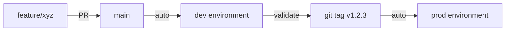
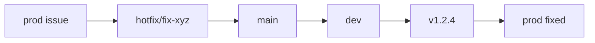

# Release Strategy

Code Remote uses trunk-based development with environment-specific deployments.

---

## Environments

| Environment | Trigger | Purpose |
|-------------|---------|---------|
| **dev** | Push to `main` | Integration testing |
| **staging** | Manual | Pre-production validation |
| **prod** | Version tag (`v*`) | Production users |

---

## Release Flow



---

## Development Workflow

### 1. Feature Development
```bash
git checkout -b feature/my-feature
# ... develop ...
git push origin feature/my-feature
# Create PR to main
```

### 2. PR Checks
- Backend linting (ruff)
- Frontend linting (eslint)
- Backend unit tests
- Frontend type checking
- All checks must pass

### 3. Merge to Main
```bash
# Merge PR via GitHub UI
# Auto-triggers deploy to dev
```

---

## Production Release

### 1. Validate in Dev
- Test features manually
- Run integration tests
- Verify no regressions

### 2. Create Version Tag
```bash
git tag v1.2.3
git push origin v1.2.3
```

### 3. Automated Deployment
- Tag triggers prod deploy
- Same pipeline as dev

---

## Semantic Versioning

| Change Type | Bump | Example |
|-------------|------|---------|
| Breaking API changes | MAJOR | v1.0.0 → v2.0.0 |
| New features | MINOR | v1.0.0 → v1.1.0 |
| Bug fixes | PATCH | v1.0.0 → v1.0.1 |

### Tag Format
```
v<MAJOR>.<MINOR>.<PATCH>

Examples:
  v1.0.0     # Stable release
  v1.1.0     # Feature release
  v1.1.1     # Bug fix
```

---

## Pulumi Stacks

| Stack | Config File | Environment |
|-------|-------------|-------------|
| dev | Pulumi.dev.yaml | Development |
| staging | Pulumi.staging.yaml | Staging |
| prod | Pulumi.prod.yaml | Production |

---

## Rollback Procedures

### Quick Rollback
```bash
# Option 1: New patch version from previous commit
git checkout <previous-commit>
git tag v1.2.4
git push origin v1.2.4

# Option 2: Revert and deploy
git revert <bad-commit>
git push origin main  # → dev
git tag v1.2.4
git push origin v1.2.4  # → prod
```

### Infrastructure Rollback
```bash
cd infra/pulumi
pulumi stack history --stack prod  # View history
pulumi up --target-dependents --stack prod  # Selective update
```

---

## Hotfix Process



```bash
# Create hotfix branch from main
git checkout -b hotfix/fix-critical-bug main

# Fix and test
git commit -m "fix: critical bug"

# Merge to main (deploys to dev)
git checkout main
git merge hotfix/fix-critical-bug
git push origin main

# Tag for prod after dev validation
git tag v1.2.4
git push origin v1.2.4
```

---

## Related Documents

- [CI/CD Pipeline](ci-cd.md) - GitHub Actions workflow
- [Local Development](local-development.md) - Development setup
